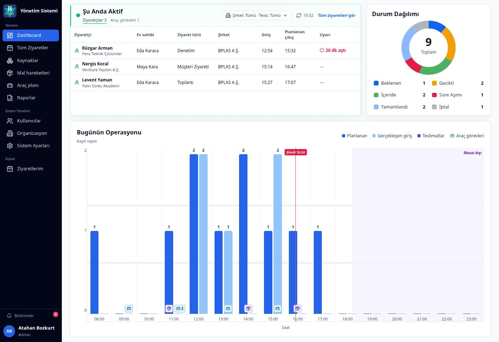

# Kurumsal Ziyaretçi ve Operasyon Yönetim Sistemi

Çok şirketli ve çok tesisli yapılarda ziyaret planlama, giriş-çıkış operasyonları, kaynak atama ve yönetici raporlamasını ortak bir çalışma alanında birleştiren rol tabanlı web uygulaması.

[Canlı uygulamayı görüntüle](https://staj-projesi2.vercel.app)

> **Güncel durum:** Proje aktif geliştirme aşamasındadır. Uygulama şu anda gerçek API'lerle değiştirilebilecek bir mock servis katmanı üzerinde çalışan frontend ürünüdür. Backend, gerçek kimlik doğrulama, e-posta, QR ve fiziksel erişim-kontrol entegrasyonları henüz bulunmamaktadır.

## Problem ve Ürün Yaklaşımı

Kurumsal ziyaret süreçleri; çalışan, yönetici, güvenlik ve admin kullanıcılarının farklı ihtiyaçları nedeniyle yalnızca bir kayıt formundan ibaret değildir. Planlama, giriş-çıkış takibi, ziyaretçi kartları, kaynak kullanımı, operasyonel gecikmeler ve dönemsel raporlama aynı ürün içinde fakat rol bazlı yetkilerle ele alınmalıdır.

Bu proje, ziyaret yaşam döngüsünü tek bir sistemde görünür ve yönetilebilir hâle getirmek amacıyla tasarlanmıştır. Ürün; çalışanların ziyaret planlayabildiği, yöneticilerin şirket genelindeki operasyonları izleyebildiği, güvenliğin fiziksel giriş-çıkış sürecini yürütebildiği ve adminlerin sistem yapılandırmasını yönetebildiği modüler bir yapıya sahiptir.

## Rolüm ve Katkılarım

- Kurum ihtiyaçlarını ve paydaş beklentilerini ürün kapsamına dönüştürdüm.
- Kullanıcı rollerini, yetki sınırlarını ve temel iş akışlarını belirledim.
- Ziyaret planlama, zaman çizelgesi, toplantı yaşam döngüsü, kaynak atama ve raporlama özelliklerini kapsamlandırdım.
- Bilgi hiyerarşisi, kullanıcı akışları ve arayüz davranışları hakkında ürün ve UI/UX kararları aldım.
- İşleri aşamalara ayırarak görevleri AI ajanlarına tanımladım.
- Üretilen çıktıları işlevsel ve görsel gereksinimlere göre değerlendirdim; düzeltme ve iyileştirmeleri PR tabanlı bir süreçle yönlendirdim.

> Ürün kararları, kapsam, kullanıcı akışları ve çıktı değerlendirmesi tarafımdan yürütülmüştür. Kod üretimi AI ajanlarıyla gerçekleştirilmiştir.

## Ürün Kapsamı

- Ziyaret oluşturma, düzenleme, yeniden planlama ve iptal akışları
- Gün, hafta ve ay görünümleriyle ziyaret zaman çizelgesi
- Ziyaret detayları ve toplantı yaşam döngüsü
- Şirket ve tesis bağlamına göre filtreleme
- Yönetici ve admin dashboard'ları
- Aktif ziyaretler, durum dağılımı ve günlük operasyon görünümü
- Kaynak, kullanıcı ve organizasyon yönetimi arayüzleri
- Mal hareketleri ve araç planlama modülleri
- Filtrelenebilir raporlar ile CSV, Excel ve PDF çıktıları

## Kullanıcı Rolleri

| Rol | Temel sorumluluk |
| --- | --- |
| Çalışan | Kendi ziyaretlerini planlama, düzenleme, erteleme ve iptal etme |
| Yönetici | Şirket genelindeki ziyaretleri ve raporları görüntüleme |
| Güvenlik | Plansız ziyaret kaydı, kart atama ve giriş-çıkış operasyonları |
| Admin | Kullanıcı, organizasyon, kaynak ve sistem yapılandırmasını yönetme |

## Teknolojiler

- React 19 ve TypeScript
- Vite
- Tailwind CSS ve shadcn/ui temelli bileşenler
- React Hook Form ve Zod
- Recharts ve date-fns
- Vitest ve ESLint

## Yerel Çalıştırma

    pnpm install
    pnpm dev

Temel doğrulama komutları:

    pnpm test
    pnpm typecheck
    pnpm lint
    pnpm build

## Proje Dokümantasyonu

- [Ürün kapsamı ve davranışları](PRODUCT_SPEC.md)
- [Arayüz ilkeleri](UI_SPEC.md)
- [Teknoloji yığını](TECH_STACK.md)
- [Geliştirme planı](DEVELOPMENT_PLAN.md)
- [Paydaş notları](STAKEHOLDER_NOTES.md)

## Kapsam Notları

- Ziyaretçi kartları fiziksel numaralı kartlar olarak ele alınır; erişim-kontrol donanımıyla entegre değildir.
- Gecikme durumu ayrı bir ziyaret statüsü değil, mevcut zaman ve planlanan çıkış üzerinden hesaplanan bir göstergedir.
- Mal hareketleri ve araç planlama, ziyaret yaşam döngüsünden ayrı operasyon modülleri olarak ele alınır.
